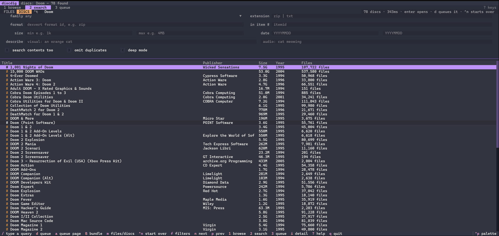
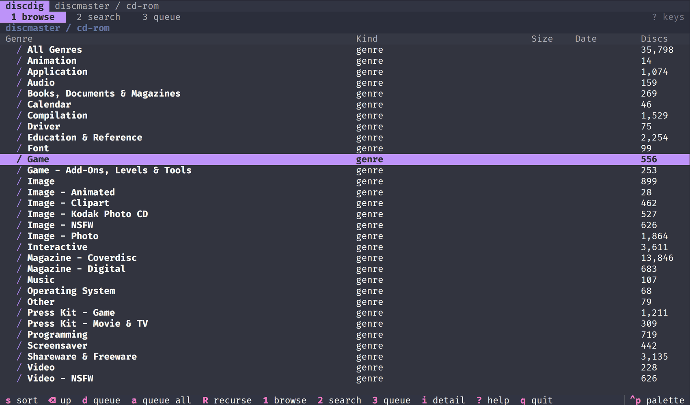
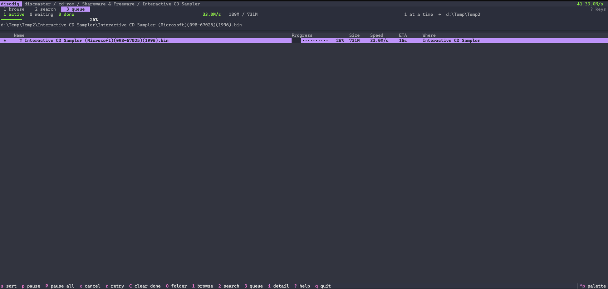

<h1 align="center">discdig</h1>

<p align="center">
  <b>Browse and download 1.9 billion vintage files, from your terminal.</b>
</p>

<p align="center">
  A keyboard-first TUI for <a href="https://discmaster.textfiles.com">discmaster.textfiles.com</a> —
  the searchable index of 43,000-odd CD-ROMs,<br>
  floppies and FTP mirrors preserved on <a href="https://archive.org">archive.org</a>.
</p>

<p align="center">
  <a href="#download">Download</a> ·
  <a href="#screenshots">Screenshots</a> ·
  <a href="#install">Install</a> ·
  <a href="#quick-start">Quick start</a> ·
  <a href="#the-three-panes">Panes</a> ·
  <a href="#keys">Keys</a> ·
  <a href="#credits">Credits</a> ·
  <a href="#license">License</a>
</p>

<p align="center">
  <a href="https://github.com/starrlord/discdig/actions/workflows/build.yml"></a>
  <a href="https://github.com/starrlord/discdig/actions/workflows/live-tests.yml"></a>
  <a href="https://github.com/starrlord/discdig/releases/latest"></a>
  
  <a href="LICENSE"></a>
</p>

---

DiscMaster is a superb piece of preservation work: a billion-plus files pulled
out of vintage media, identified, converted and made searchable. `discdig` puts
a file-manager interface and a proper download queue in front of it — drill into
a disc, tick what you want, and let a resumable queue fetch it while you carry on
looking.

## Screenshots

<table>
  <tr>
    <td width="33%" align="center">
      <a href="assets/screen3.png">
        
      </a>
    </td>
    <td width="33%" align="center">
      <a href="assets/screen1.png">
        
      </a>
    </td>
    <td width="33%" align="center">
      <a href="assets/screen2.png">
        
      </a>
    </td>
  </tr>
  <tr>
    <td align="center"><sub><b>Search</b> — 78 Doom discs in 343&nbsp;ms</sub></td>
    <td align="center"><sub><b>Browse</b> — collections, genres, discs</sub></td>
    <td align="center"><sub><b>Queue</b> — resumable, verified</sub></td>
  </tr>
</table>

<sub>Click any shot for the full-size version.</sub>

## Download

**Windows, no Python needed.** Grab `discdig-<version>-windows-x64.zip` from the
[releases page](https://github.com/starrlord/discdig/releases), extract it wherever you
like, and run `discdig.exe`. About 15 MB zipped, 28 MB extracted.

```
discdig\
├─ discdig.exe        ← run this
├─ _internal\         ← keep it next to the exe
├─ LICENSE
└─ README.txt
```

Nothing is installed and nothing touches the registry; delete the folder to
remove it. Settings and the queue live in `%USERPROFILE%\.discdig`, and
downloads default to `%USERPROFILE%\Downloads\discmaster`.

If anything looks wrong, `discdig.exe check` verifies the build on your machine —
files, stylesheet, disk access and HTTPS to both sites.

> Windows may show a SmartScreen warning the first time, because the build is
> unsigned. *More info → Run anyway*, or build it yourself with the script below.

To run from source instead — on any platform — carry on to Install.

## Install

Needs **Python 3.10+**. [`uv`](https://docs.astral.sh/uv/) is the quickest route,
but plain `venv` works just as well.

<details open>
<summary><b>Windows — PowerShell</b></summary>

```powershell
git clone https://github.com/starrlord/discdig.git
cd discdig

uv venv --python 3.12 .venv
uv pip install -e .

.\discdig.cmd
```

Without `uv`:

```powershell
py -3.12 -m venv .venv
.\.venv\Scripts\python.exe -m pip install -e .
.\discdig.cmd
```

To put `discdig` on your `PATH` for the session:

```powershell
$env:Path = "$PWD\.venv\Scripts;$env:Path"
discdig
```

</details>

<details open>
<summary><b>macOS / Linux — bash or zsh</b></summary>

```bash
git clone https://github.com/starrlord/discdig.git
cd discdig

uv venv --python 3.12 .venv
uv pip install -e .

chmod +x discdig.sh
./discdig.sh
```

Without `uv`:

```bash
python3 -m venv .venv
./.venv/bin/python -m pip install -e .
./discdig.sh
```

Or activate the environment and use the installed command directly:

```bash
source .venv/bin/activate
discdig
```

</details>

Any terminal with Unicode and 256 colours will do. It degrades sensibly to 16
colours and reflows down to 80 columns; state is carried by a glyph as well as a
colour, so it stays readable in monochrome.

## Quick start

```console
$ discdig                                    # open the app
$ discdig search doom                        # open it on a search
$ discdig browse 21129                       # open it at a disc
$ discdig browse 21129/Doom2Explosion.bin    # …or inside one

$ discdig search doom --ext wad --print      # print hits, no interface
$ discdig get 21129 Doom2Explosion.bin       # download, no interface
$ discdig queue                              # what is outstanding
$ discdig queue --run                        # drain the queue headlessly
$ discdig config                             # where settings live
$ discdig check                              # verify the install
```

On Windows use `.\discdig.cmd` in place of `discdig` unless the venv is on your
`PATH`; on macOS and Linux use `./discdig.sh`.

## The three panes

### `1` Browse

`cd-rom / disk / ftp / other` → genre → disc → into the ISO → into its folders.
`enter` descends, `backspace` climbs, and the crumb trail always says where you
are. `ctrl+n` climbs the whole way out at once, back to a blank slate — quicker
than nine backspaces when you are deep inside an ISO and done with it.

Genres are listed alphabetically, discs by title, and the columns are labelled
for the level you are on. `s` — or a click on a header — sorts by any column, and
the sort sticks as you move around. Folders, having no size, settle at the bottom
of a size sort in either direction.

### `2` Search

Press `2` and start typing. The `FILES / DISCS` switch in the search bar
(`ctrl+t`, or click it) decides what you are looking for, and the difference
matters. Searching *files* for "Rise of the Triad" finds 127 catalogue `.html`
entries spread across compilation discs; searching *discs* finds the one CD-ROM
you were after.

File mode speaks DiscMaster's full query language — boolean terms, wildcards,
phrases, extension and format filters, byte and pixel and duration ranges, file
dates, safe search, de-duplication and nine sort orders. It also reaches the
semantic searches: *describe* an image ("an orange cat") or a sound ("cat
meowing") and the server matches on content rather than filename.

Sorting runs server-side, so "largest first" means largest of all 7,094 matches,
not largest of the hundred on screen. `enter` on a hit jumps the Browse pane to
the folder holding it, and `backspace` brings you back to the results with the
cursor where you left it. `ctrl+n` starts a fresh search.

### `3` Queue

What is downloading, how fast, how much is left. Pause one or all, cancel, retry,
change how many run at once. The queue lives in SQLite, so it survives quitting
and picks up where it left off.

## Keys

`?` shows the full list inside the app. The short version:

| Key | Does |
| --- | --- |
| `1` `2` `3` | browse / search / queue |
| `↑` `↓` `j` `k` `g` `G` | move |
| `enter` `backspace` | in / out |
| `space` `ctrl+a` `escape` | mark / mark all / clear |
| `d` `a` `R` | queue selection / whole listing / recursively |
| `s` `S` | sort by the next column / reverse — or click a header |
| `/` | browse and queue: filter the rows on screen · search: jump to the query box (`\` filters there) |
| `m` `ctrl+t` | search: files ⇄ whole discs |
| `ctrl+n` | start over — browse: back to the root · search: clear the query, filters and sort |
| `B` | fetch all search matches as one `.tar.gz` |
| `i` `o` | detail panel · open in a web browser |
| `p` `P` `x` `r` `C` `+` `-` | queue: pause, pause all, cancel, retry, clear, more/fewer |
| `,` `?` `ctrl+p` | settings · help · command palette |

Marks are the point: tick eight files with `space`, then press `d` once. Where
nothing is marked, actions apply to the row under the cursor.

## What the queue gives you

**Resumable transfers.** Downloads stream to `<name>.part` and are renamed into
place only once complete. Interrupt a 5 GB disc image, quit, come back tomorrow —
it continues from the byte it reached, using an HTTP range request.

**Checksum verification.** Every DiscMaster item mirrors an archive.org item. For
files archive.org hosts directly — the disc images, the scans — discdig fetches
from there: usually faster, and it arrives with an MD5 that is verified before
the file is accepted.

**Integrity checks on everything else.** Each queued file carries the size its
listing advertised. Anything that arrives a different length is reported rather
than quietly saved, so a finished download is one you can trust.

**No wasted work.** A file already on disk at the right size is skipped, and
re-queueing something already in the queue is a no-op.

**Polite by default.** One transfer runs at a time — DiscMaster is volunteer-run,
and a single stream usually saturates the link anyway. `+` and `-` in the queue
pane change it (up to 8) if you want more. `B` in the search pane uses
DiscMaster's own bundle endpoint to fetch every match as a single `.tar.gz`,
which is far kinder to the server than a thousand separate requests; the server
caps a bundle at 1 GiB.

## Configuration

Downloads default to `~/Downloads/discmaster/<Disc Title>/<path inside the disc>`.
Settings (`,`) switch that to `<itemid>/…` or to flat filenames, and change the
download directory, how many transfers run at once (one by default), safe
search, and whether to prefer archive.org.

Themes come from `ctrl+p` → *Change theme*. It starts on Dracula; pick another
and it sticks — Textual's built-ins (nord, gruvbox, catppuccin, tokyo-night…)
alongside discdig's own amber-phosphor theme, `discdig`.

State lives in `~/.discdig/` — `config.json` and `queue.db`. Set `DISCDIG_HOME`
to move it elsewhere.

## Tests

The suites run against the live site rather than fixtures, so they double as a
canary for changes in DiscMaster's markup:

```powershell
.\.venv\Scripts\python.exe tests\test_api_live.py         # parsers, search, collections
.\.venv\Scripts\python.exe tests\test_downloader_live.py  # resume, verify, pause, persistence
.\.venv\Scripts\python.exe tests\test_ui_live.py          # drives the TUI headlessly
.\.venv\Scripts\python.exe tests\snapshot.py              # renders frames as text
```

```bash
./.venv/bin/python tests/test_api_live.py
./.venv/bin/python tests/test_downloader_live.py
./.venv/bin/python tests/test_ui_live.py
./.venv/bin/python tests/snapshot.py
```

## Building the Windows release

```powershell
.\build_windows.ps1 -Clean
```

PyInstaller packs the app in one-folder mode and the script zips the result into
`dist\`. One folder rather than one file because a single-exe build unpacks
~28 MB to a temp directory on every launch, which is a noticeable pause on a tool
you open to type one search into; the folder form starts instantly.

The script refuses to produce a zip unless the packaged `discdig.exe check`
passes, so a build that is missing its stylesheet or its TLS certificates never
reaches a release. Use `-SkipNetworkCheck` to keep that gate local-only.

`uv` is used when it is on `PATH`; otherwise PyInstaller is installed into
`.venv` and invoked directly, so a plain `python -m venv` setup builds too.

### Continuous integration

| Workflow | When | What |
| --- | --- | --- |
| `build.yml` | every push and PR to `main` | packs the bundle on a clean Windows runner and uploads it as an artifact (14 days) — so packaging breakage surfaces immediately |
| `build.yml` | pushing a `v*` tag | the same build, published as a GitHub Release with the zip attached |
| `live-tests.yml` | Mondays, or on demand | runs the live suites as a canary for changes in DiscMaster's markup |

Releases are deliberate rather than automatic: a tag publishes, a commit does
not. The tag has to match `discdig.__version__` or the build stops, so a release
can't ship mislabelled.

The live suites deliberately do **not** run on every push — they talk to the
real site, and putting that load on a volunteer-run server for every commit
would be rude, as well as going red whenever the site is briefly slow. Packaging
in CI skips the network half of the smoke test for the same reason; the full
check still runs, but cannot fail the build.

To cut a release:

```powershell
# bump __version__ in discdig/__init__.py first, then
git tag v1.1.0
git push origin v1.1.0
```

## How it talks to the site

DiscMaster offers a JSON search API; the rest of it is clean, lightweight HTML
designed to work in any browser, which discdig reads directly.

| Endpoint | Used for |
| --- | --- |
| `/search?…&outputAs=json` | the search API — `pageNum` is 0-indexed |
| `/search?download=true&…` | 302 → `/download/<token>.tar.gz`, max 1 GiB |
| `/browse/<itemid>[/<path>]` | directory and archive listings |
| `/file/<itemid>/<path>` | original bytes; supports `Range` |
| `/cd-rom` `/disk` `/ftp` `/other` | collection indexes, with `?search=` |
| `archive.org/metadata/<id>` | sizes and MD5s for the mirrored originals |

Listings are read structurally — anchored on the `<a name="family">` section
markers, then taking each link with the size, date and format text that follows
it. Each family of file (directories, archives, images, videos…) gets a table
laid out to suit its contents, so reading by structure keeps discdig working
across all of them. The genre index is a three-across grid running
alphabetically down each column, so discdig re-sorts it into a single list.

Requests are kept modest — a small connection pool, a handful of concurrent
transfers, exponential backoff on retry, and bundles preferred over many small
requests.

## Credits

- **[DiscMaster](https://discmaster.textfiles.com)** — introduced by
  [Jason Scott](https://mastodon.archive.org/@textfiles) in 2022, it makes the
  insides of tens of thousands of 1990s–2000s discs findable. The index, the
  search, the conversion pipeline and the hosting are what make any of this
  possible; discdig is only a front end onto their work.
- **[dexvert](https://github.com/Sembiance/dexvert)** by
  [Sembiance](https://github.com/Sembiance) — identifies and converts over 3,700
  vintage file formats, and is what lets DiscMaster say *what* every one of those
  billion files actually is.
- **[archive.org](https://archive.org)** — the Internet Archive preserves the
  original disc images, and the thousands of people who uploaded them are the
  reason this material still exists. discdig pulls whole-disc downloads and their
  checksums straight from there.
- **[Textual](https://textual.textualize.io)** and
  [Rich](https://rich.readthedocs.io) by Textualize — the TUI framework.
- **[httpx](https://www.python-httpx.org)** — the HTTP client.

If you find discdig useful, the people above did the hard part. Consider
[donating to the Internet Archive](https://archive.org/donate).

Please use it considerately: DiscMaster is run as a labour of love on finite
hardware and bandwidth.

## License

[MIT](LICENSE) © 2026 Joshua Starr.

discdig is an independent client. It is not affiliated with, endorsed by, or
supported by DiscMaster or the Internet Archive. The files it downloads belong to
their respective rights holders.
